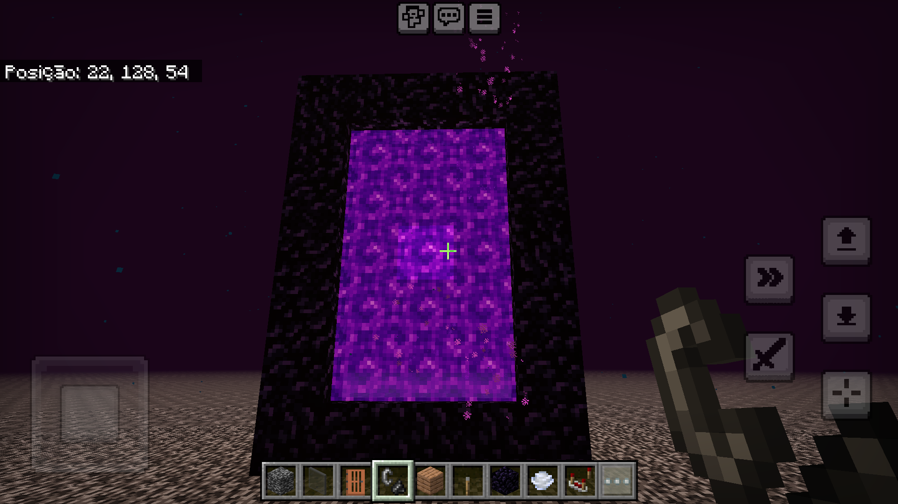
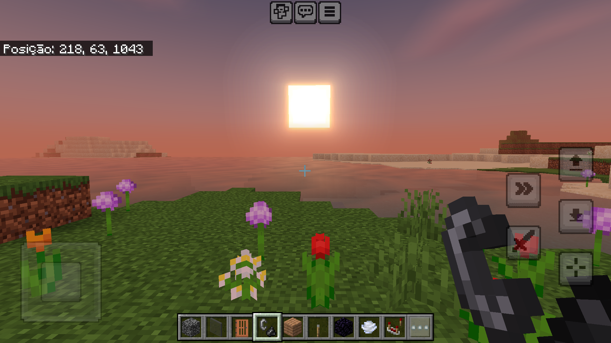

# MCBE_Android_Patcher
A shell script to patch the android arm32 and arm64 versions of minecraft bedrock edition


Tested on Minecraft Bedrock Edition 1.20.62, 1.20.61, and 1.20.72, may not work in future versions


You need the [oficial version](https://play.google.com/store/apps/details?id=com.mojang.minecraftpe) to use this script


Patches:
1) allow construction on the nether roof;
2) allow installation of shaders for renderdragon;

Screenshots:



------

## How to use

**On Linux**

1) Make a backup of your wolds
   
2) Install the following dependencies
  - java-openjdk (openjdk)
  - zsh
  - patchelf
  - wget 
  - sed
  - android-tools (android-tools-adb)
  - android sdk build tools (you can install it using the [android studio](https://developer.android.com/studio?hl=pt-br))

3) Enable USB debugging on your phone in [developer options](https://developer.android.com/studio/debug/dev-options)

4) Connect your phone to your computer via USB cable
   
6) download the script and give it execution permissions with the following commands
```
wget -O ~/MCBE_Patcher.sh https://raw.githubusercontent.com/Coffee-0xFF/MCBE_Android_Patcher/main/Minecraft_Patcher_Linux.sh
chmod +x ~/MCBE_Patcher.sh
```
7) Run the script with the option adb. If all processes are successful, the script will automatically modify the game, uninstall the original and install the new modded apk
```
~/MCBE_Patcher.sh adb
```

**On Android**
1) Make a backup of your worlds
   
2) Using a file manager, copy the apks from the Google Play Store split apk into a folder, compress the files into a zip (some file managers, like X-Plore for example, do the compression automatically) and rename the zip file to Minecraft.zip
   


3) Install the [Termux app](https://f-droid.org/pt_BR/packages/com.termux)
   
4) Open termux and run the following commands one at a time to install the dependences
```
termux-setup-storage
apt update
apt upgrade
apt install -y apksigner openjdk-17 sed zsh wget patchelf
```
5) Now locate the folder with the zip file with the apks and go to it with the cd command

example:
```
cd ~/storage/shared/my_folder_with_the_zip_file/
```
you can use the *ls* command to list the folders and files in the path you are
```
ls
``` 

6) download the script and give it execution permissions with the following commands
```
wget -O ~/script.sh raw.githubusercontent.com/Coffee-0xFF/MCBE_Android_Patcher/main/Minecraft_Patcher_Termux.sh
chmod +x ~/script.sh
```

7) Run the script, if it is already in the folder with the zip file with the apks.
```
~/script.sh ./Minecraft.zip
```

8) If everything went well, you now have a modified apk with the path ~/minecraft_modded.apk, so move it to your phone's internal memory with the following command
```
~/minecraft_modded.apk ~/storage/shared/minecraft_modded.apk
```

9) Now uninstall the original game and install the minecraft modded  manually

-------

## General notes:
You can disable one of the two patches, to do this, change the value 1 of the variables nether_roof_limit_to_256 or materialbinloader to 0. The materialbinloader patch allows the installation of shaders.

This script only works with Android versions downloaded from the Google Play Store

This script only works for the game compiled for arm or aarch64 (arm64)

**DO NOT** share the apk generated by you, this violates the [EULA](https://www.minecraft.net/en-us/eula)

------

## Links

- MaterialBinLoader: [source code](https://github.com/ddf8196/MaterialBinLoader)

- APK_Editor: [source code](https://github.com/REAndroid/APKEditor)

----

## Special Thanks

-[](https://discord.gg/sWb4YmX) , thanks for reverse engineering the game
